# Bank.Management
In this project you can see about bank management and bank account opening money transfer, account withdrawal and many banking operations.
> In this project we can learn more about working with ``File`` s and 
write code according to ``The Standard``rules.

## How does the BankManagmend project work?
#### The BankManagement project allows us to perform banking operations and customer service operations.

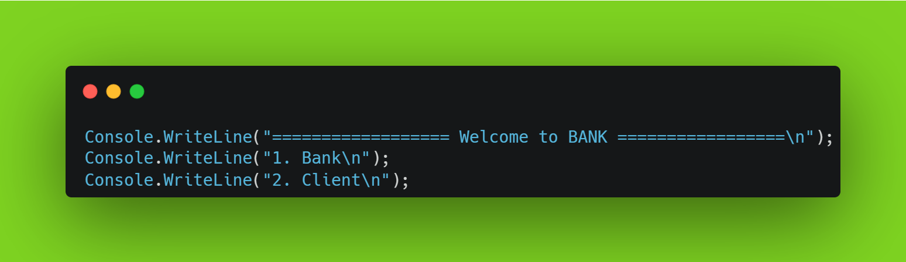

## 1. Post Deposit For Bank
#### 1.1 You can open an account in the Bank in this section.

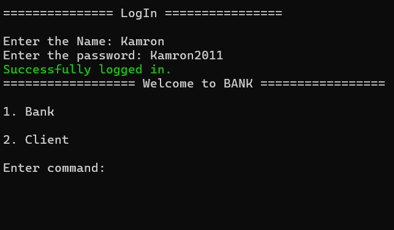

#### 1.2 In this section, you can view errors in opening an account at the Bank.

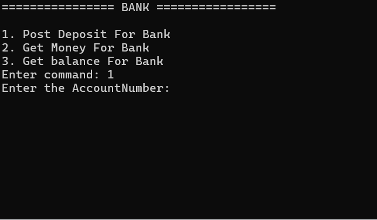

## 2. Get Money For Bank
#### 2.1 In this section, you can set up a withdrawal from a bank account.

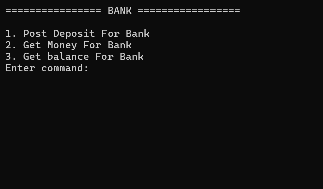

#### 2.2 In this section, you can see the error in withdrawing money from the bank account.

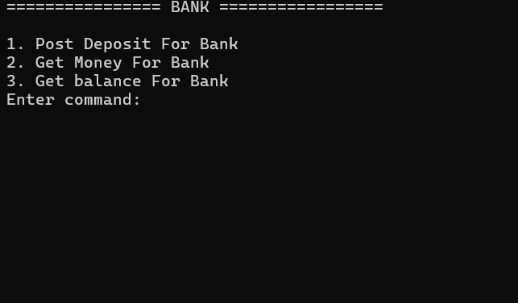

## 3. Get balance For Bank

#### 3.1 In this section, you can find out the amount of money in the balance of the Bank account.

#### 3.2 In this section, when you find out the amount of money in the balance of the Bank account, an error will occur if you enter the account number incorrectly.

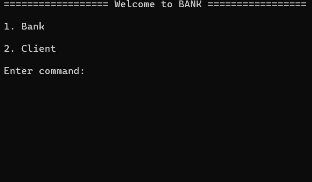

## 4. Post For Client

#### 4.1 In this section you can open an account for the Client.

#### 4.2 If you enter the Client information incorrectly, it will give an error.

## 5. Transfer Money Between Accounts For Client

#### 5.1 In this section, you can transfer money from two accounts to each other.

#### 5.2 In this section, when you transfer money from two accounts to each other, if you enter the wrong account number in the database, an error will be returned.

## 6. Delete For Client

#### 6.1 In this section, you can delete the Client's data in the database.

## 6.2 This section will return an error if you enter Client data that does not exist in the database.

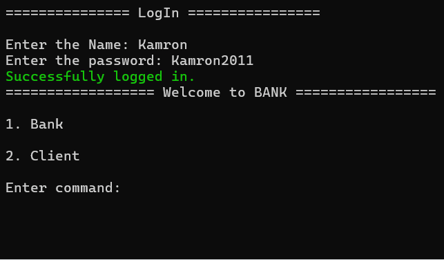

## 7. Get All Client

#### 7.1 In this section, you can get all the Client information available in the database.

## 8. Get Balance For Client

#### 8.1 In this section, you can view the amount of money in the Client's account.

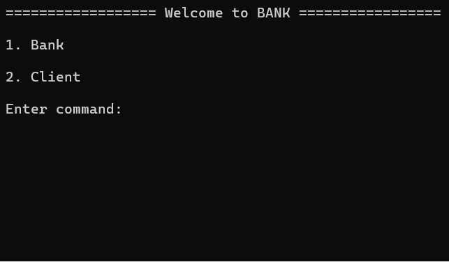

#### 8.2 In this section, an error will be returned if the account number you entered to check the amount of money in the Client's account is not in the database.

## 9. LogIn 
#### 9.1 In this section, it will work if the name and password you entered are in the database.

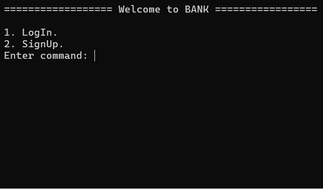

#### 9.2 If the name and password you entered are not found in the database, it will go to the SignUp section.

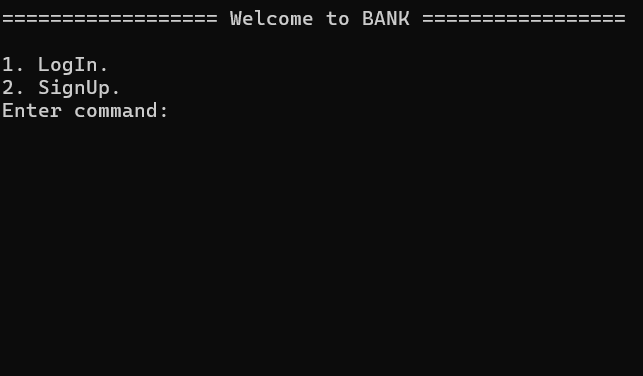

## 10. SignUp

#### 10.1 In this section, you can create a new one if your data is not found in the database.

#### 10.2 If you enter a password with less than 8 characters when creating an account, an error will occur.

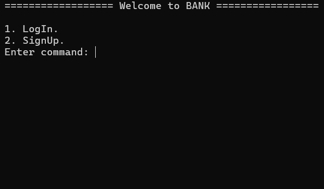